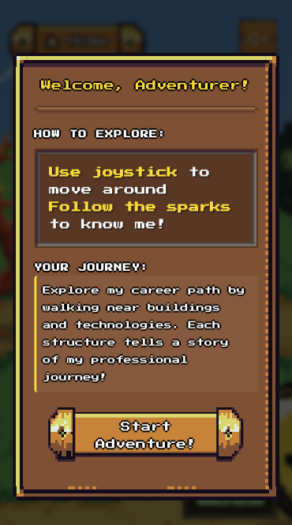
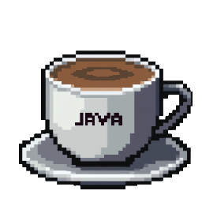

# 🎮 Retro Dev Journey

[](https://reactjs.org/)
[](https://golang.org/)
[](https://www.mongodb.com/)
[](https://www.typescriptlang.org/)
[](LICENSE)

**Interactive Portfolio & CV built with React featuring a unique pixel-art timeline design. Tracks user interactions with a simple Go backend and MongoDB storage. Includes a basic admin dashboard to monitor site usage and engagement metrics.**

**Live version [Here](https://retrojourney.dev/)** at https://retrojourney.dev/

**React + Go + MongoDB**
<div align="left">
  
  
  
  
</div>

> 🚀 **FULL Development Timeline:** 2 weeks development + 1 week debugging

---

## Fast Deploy with Docker

Want to try it right away? The application includes automated setup scripts for quick deployment!

### Requirements
- **Docker**
- **Git** (Optional or download ZIP)

### Quick Setup Options

#### Option 1: Fully Automated Setup (Recommended)
```bash
git clone https://github.com/SplinterPezz/retro-dev-journey
cd retro-dev-journey
docker network create retro_dev_journey
sh setup-auto.sh && docker compose up -d
```
This will automatically create environment files (.env) with randomly generated secure passwords and usernames. Perfect for testing or development environments on localhost.

#### Option 2: Manual Configuration
```bash
git clone https://github.com/SplinterPezz/retro-dev-journey
cd retro-dev-journey
docker network create retro_dev_journey
sh setup.sh && docker compose up -d
```
This allows you to manually input passwords and usernames with sensible default values. Ideal when you want control over the configuration.

> 🎯 **That's it!** The application will be available at `http://localhost:3000` and the admin panel at `http://localhost:3000/admin`

### What the Setup Scripts Do:
- **Environment File Creation**: Automatically generates `.env` files for both frontend and backend
- **Database Configuration**: Sets up MongoDB connection strings and credentials
- **JWT Security**: Generates secure JWT secrets for authentication
- **Admin User**: Creates initial admin user for dashboard access
- **Docker Orchestration**: Configures multi-container deployment with proper networking

The Docker setup leverages multi-stage builds to optimize container sizes and includes health checks to ensure all services are running correctly. The compose configuration handles service dependencies, ensuring MongoDB starts before the backend, which starts before the frontend.


---

## 📋 Requirements without Docker

| Technology | Version | Notes |
|------------|---------|-------|
| **Node.js** | 22.16.0 | LTS version recommended |
| **NPM** | 10.9.2 | Package manager |
| **Go** | 1.24.3 | Backend language |
| **MongoDB** | 8.10.0 | Database system |
| **Air (optional)** | v1.62.0 | Go hot reload tool |

> ⚠️ **Version Compatibility:** Docker and MongoDB should work with older versions. However, Node.js, NPM, and Go versions haven't been tested with older releases. All development was done using LTS versions for maximum stability.


---

## ⏱️ Development Timeline
**Week 1: Foundation (7 days)**
* **Day 1**: Research pixel art games, RPG UI frameworks, and portfolio inspiration
* **Days 2-3**: Project architecture, Docker setup, MongoDB schema design
* **Days 4-5**: Midjourney asset generation, sprite optimization, visual design

**Week 2: Core Development (7 days)**
* **Days 6-12**: Frontend implementation - player movement, collision detection, mobile controls, path generation, UI components
* **Days 13-14**: Go backend with JWT auth, MongoDB integration, analytics engine, admin dashboard

**Week 3: Polish & Debug (7 days)**
* **Days 15-21**: Cross-browser compatibility, quest system, performance optimization, bug fixes and also this file.

---

## 📸 Screenshots

### Desktops


<div align="left">
  
  
</div>

<div align="left">
  
  
</div>


### Mobile

<div align="left">
  
  
  
</div>

<div align="left">
  
  
  
</div>

---

## ✨ Key Features

- 🎮 **Interactive 2D World** - Navigate through a pixel-art landscape representing career progression
- 📊 **Real-time Analytics** - Track user interactions with MongoDB storage and admin dashboard
- 📱 **Responsive Design** - Optimized for both desktop and mobile with touch controls
- 🛤️ **Dynamic Path Generation** - Automatically generated paths connecting career milestones
- 🎯 **Quest System** - Daily quest tracking for user engagement
- 🎵 **Audio Controls** - Immersive background music with volume controls
- 📄 **CV Management** - Secure upload/download functionality for CV files in the admin area.

---

## 🛠️ Tech Stack

### Backend (Go)
```
github.com/gin-contrib/cors v1.7.5       // CORS middleware
github.com/gin-gonic/gin v1.10.0         // Web framework
github.com/golang-jwt/jwt/v5 v5.2.2      // JWT authentication
github.com/joho/godotenv v1.5.1          // Environment variables
go.mongodb.org/mongo-driver v1.17.2      // MongoDB driver
golang.org/x/crypto v0.36.0              // Cryptographic functions
```

### Frontend (React + TypeScript)
```json
{
  "react": "^19.1.0",
  "react-dom": "^19.1.0",
  "typescript": "^4.9.5",
  "@reduxjs/toolkit": "^2.8.2",
  "react-redux": "^9.2.0",
  "redux-persist": "^6.0.0",
  "react-router-dom": "^7.6.1",
  "framer-motion": "^12.15.0",
  "@mui/material": "^7.1.1", // Can be easly removed, used for login card and admin buttons.
  "react-apexcharts": "^1.7.0",
  "react-joystick-component": "^6.2.1"
}
```

---

## 🚀 Quick Start

### Prerequisites
```bash
# Verify installations
node --version    # Should be 22.16.0+
npm --version     # Should be 10.9.2+
go version        # Should be 1.24.3+
docker --version  # Should be 28.1.1+
```

### Installation

1. **Clone the repository**
   ```bash
   git clone https://github.com/yourusername/retro-dev-journey.git
   cd retro-dev-journey
   ```

2. **Backend Setup**
   ```bash
   cd backend
   
   # Install Go dependencies
   go mod download
   
   # Copy environment file
   cp .env_example .env.local
   # Edit .env.local with your configuration
   
   # Run with hot reload (if Air is installed)
   air
   
   # OR run with standard Go
   go run main.go
   ```

3. **Frontend Setup**
   ```bash
   cd frontend
   
   # Install dependencies
   npm install
   
   # Start development server
   npm run start:loc    # Local environment
   npm run start:dev    # Development environment
   npm run start:stage  # Staging environment
   npm run start:prod   # Production environment
   ```

4. **Database Setup**
   ```bash
   # Start MongoDB (with Docker)
   docker compose up -d database
   
   # Or use your existing MongoDB installation updating the .env files on backend folder
   ```

### Access the Application
- **Frontend:** http://localhost:3000
- **Backend API:** http://localhost:8421
- **Admin Dashboard:** http://localhost:3000/admin (requires login)

---

## 🎮 Game Controls

### Desktop
- **Movement:** WASD or Arrow keys
- **Run:** Hold Shift or Spacebar while moving
- **Interaction:** Walk near buildings/technologies to view information

### Mobile
- **Movement:** Virtual joystick (bottom right)
- **Interaction:** Tap and move near structures

---

## 📁 Project Structure

```
retro-dev-journey/
├── backend/                 # Go backend application
│   ├── internal/           # Internal packages
│   │   ├── auth/          # Authentication logic
│   │   ├── handlers/      # HTTP handlers
│   │   ├── models/        # Data models
│   │   └── utils/         # Utility functions
│   │ 
│   ├── mongodb/           # Database connection and queries
│   ├── uploads/           # CV file storage folder
│   ├── Dockerfile         # Backend Docker container config
│   ├── go.mod             # Go dependencies
│   ├── go.sum             # Go dependencies
│   ├── air.toml           # Air config file
│   ├── main.go            # Application entry point
│   │ 
│   ├── .env               # Extra env file
│   ├── .env.dev           # Env File for development
│   ├── .env.local         # Env File for localhost
│   └── .env.prod          # Env File for production
│   
│ 
├── frontend/              # React frontend application
│   ├── public/            # Static assets
│   │   ├── sprites/       # Game sprites and images
│   │   ├── backgrounds/   # Background images
│   │   ├── audio/         # Music files
│   │   ├── rpgui/         # RPGUI framework files
│   │   ├── favicon.ico    # Favicon default folder
│   │   └── index.html     # index.html for CEO
│   │ 
│   │ 
│   ├── src/               # Source code
│   │   ├── Components/    # React components
│   │   ├── Pages/         # Page components
│   │   ├── Services/      # API services
│   │   ├── store/         # Redux store
│   │   ├── hooks/         # Hooks TS folder
│   │   ├── types/         # TypeScript definitions
│   │   └── Utils/         # Utility functions
│   │ 
│   ├── Dockerfile         # Backend Docker container config
│   ├── package.json       # Frontend dependencies
│   ├── nginx.conf         # Nginx Configuration file for Docker
│   │ 
│   ├── .env.dev           # Env File for development
│   ├── .env.local         # Env File for localhost
│   └── .env.prod          # Env File for production
├── database/              # Database initialization
└── README.md              # Project documentation
```

### 🎨 Sprite Organization

```
public/sprites/
├── buildings/              # Company/workplace buildings
│   ├── eikony.png         # First internship
│   ├── unipa.png          # University
│   ├── codesour.png       # Current company
│   └── new_opportunity.png # Future opportunities
├── statues/               # Technology representations
│   ├── java.png           # Java technology
│   ├── python.png         # Python technology
│   ├── javascript.png     # JavaScript technology
│   └── [other_tech].png   # Additional technologies
├── terrain/               # Ground and path textures
│   ├── main.png           # Grass texture
│   ├── path_core.png      # Basic path segment
│   ├── path_cross.png     # Path intersection
│   └── path_t_cross.png   # T-junction path
├── player/                # Character animations
│   ├── dude_idle.gif      # Idle animation
│   ├── dude_walk_N.gif    # Walking north
│   ├── dude_walk_S.gif    # Walking south
│   └── dude_walk_E.gif    # Walking east/west
├── trees/                 # Environmental decorations
├── details/               # Small decorative elements
└── signpost/              # Company signposts
```
# Player sprites by [@marguels](https://github.com/marguels)

<div align="left">
  
</div>

<div align="left">
  
  
  
  
</div>

# Environments

<div align="left">
  
  
  
  

  
  
  
  

  
  
  
  

  
  
  
  

</div>


---

## ⚙️ Configuration

### Frontend World Configuration (`frontend/src/Pages/Sandbox/config.ts`)

The main configuration file controls the entire game world:

```typescript
// World Configuration
export const worldConfig: WorldConfig = {
  width: 2000,           // World width in pixels
  height: 3024,          // World height in pixels
  tileSize: 128          // Size of each tile
};

// Path Configuration
export const mainPathConfig = {
  startX: worldConfig.width / 2,  // Path starting X position
  startY: 100,                    // Path starting Y position
  endY: worldConfig.height,       // Path ending Y position
  width: tileSize                 // Path width
};

// Career Data Configuration
const companiesData: CompanyData[] = [
  {
    id: "codesour",
    name: "CodeSour (IT)",
    role: "Software Developer",
    period: "2019 - 2025",
    technologies: ["Java", "Spring Boot", "ReactJS", "MongoDB"],
    description: "Developed scalable backend advertising platform...",
    position: { x: 652, y: 1540 },
    image: "/sprites/buildings/codesour.png",
    collisionHitbox: { x: -135, y: -500, width: 285, height: 470 }
  }
  // Additional companies...
];
```

### Backend Configuration example (`.env_example`)

```bash
# Server Configuration
PORT=8421
ALLOW_ORIGIN='http://localhost:3000'

# Database Configuration
MONGO_URI='mongodb://db_retro_dev_journey:27017'
MONGO_USERNAME='username'
MONGO_PASSWORD='really_strong_password'
DB_NAME='retro_db'

# Authentication
JWT_SECRET='my_secret_jwt'

# Admin User
ROOT_USERNAME='root_user'
ROOT_PASSWORD='Root_password00!'
ROOT_EMAIL='root@email.com'
```

### Frontend Configuration example (`.env_example`)

```bash
REACT_APP_API_URL="http://localhost:8421"
REACT_APP_ENV=development
```
### MongoDb Configuration example (`.env_example`)

```bash
MONGO_USERNAME=username
MONGO_PASSWORD=really_strong_password
```
---

## 🔧 Development Commands

### Frontend Development

```bash
# Install dependencies
npm install

# Development servers (different environments)
npm run start:loc    # Local environment (.env.local)
npm run start:dev    # Development environment (.env.dev)
npm run start:stage  # Staging environment (.env.stage)
npm run start:prod   # Production environment (.env.prod)

# Build commands
npm run build:local  # Build for local
npm run build:dev    # Build for development
npm run build:stage  # Build for staging
npm run build:prod   # Build for production

# Testing
npm test            # Run test suite
```

### Backend Development

#### Standard Go Commands
```bash
# Install dependencies
go mod download

# Run application
go run main.go

# Build application
go build -o main .

# Set environment and run
APP_ENV=dev go run main.go
```

#### Air Hot Reload (Recommended)
If you have Air v1.62.0 installed (built with Go 1.24.3):

```bash
# Install Air (if not installed)
go install github.com/cosmtrek/air@latest

# Run with hot reload
air

# Air will automatically:
# - Watch for .go file changes
# - Rebuild the application
# - Restart the server
# - Exclude test files and tmp directory
```

---

## 🏗️ Core Features

### Interactive Game World

The application features a 2D isometric-style world where users can:

- Navigate using WASD/Arrow keys (desktop) or joystick (mobile)
- Explore career milestones represented as buildings
- Interact with technology stacks shown as statues
- Follow automatically generated paths connecting experiences
- View detailed information dialogs when approaching structures

<div align="left">
  
  
  
</div>

### Real-time Analytics

#### Tracking System
The application implements comprehensive user tracking:

- **Page Views:** Time spent on different sections
- **Interactions:** Which companies/technologies users explore
- **Device Analytics:** Mobile vs desktop usage patterns
- **Download Tracking:** CV download statistics
- **Quest Completion:** User engagement metrics

The analytics system employs a sophisticated event-driven architecture that captures user interactions without impacting performance. Each interaction is immediately queued and batch-processed to MongoDB using optimized aggregation pipelines. The system uses anonymous UUID generation based on device fingerprinting (screen resolution, timezone, user agent) to track unique users while maintaining complete privacy.

The tracking implements smart deduplication - rapid-fire interactions from the same user are filtered to prevent spam and ensure accurate metrics. Time tracking uses a progressive system that records milestones at 30 seconds, 1 minute, 2 minutes, 5 minutes, and 10 minutes, providing insights into engagement depth without overwhelming the database with constant updates.

<div align="left">
  
  
</div>

<div align="left">
  
  
</div>

<div align="left">
  
  
</div>

#### Privacy-Focused Approach
User privacy is prioritized throughout the application:

- **Anonymous Tracking:** No personal information collected or stored
- **Hash-based IDs:** User identification through device fingerprinting, not personal data
- **Data Minimization:** Only essential analytics data is captured
- **Automatic Cleanup:** Old interaction data is automatically purged
- **Transparent Tracking:** Users can see exactly what data is being collected

The privacy implementation includes automatic data retention policies that purge interaction data older than the current day, ensuring no long-term user tracking. The hashing algorithm creates consistent user IDs that reset with browser cache clearing, giving users control over their tracking footprint.

### Quest System

The application gamifies exploration through a quest system:

- Daily quest reset functionality
- Progress tracking for each career milestone
- Visual progress indicators
- Completion of daily quest

The quest system leverages Redux Persist to maintain progress across browser sessions while implementing daily reset logic based on local date comparison. Each quest completion triggers visual feedback animations and updates the global progress calculation. The system tracks 23 distinct quest objectives (companies, technologies, and CV download) with smart completion detection based on proximity and interaction events.

Quest progress is calculated in real-time using interaction data from the Redux store, with completion status persisting locally but resetting daily to encourage repeat visits. The implementation includes smooth animations for progress bar updates and expandable quest panels that conserve screen space while maintaining accessibility.

> **INSERT SCREENSHOT HERE:** Daily quest panel showing quest list with completion status, progress bar, and expandable interface

---

## 🌐 API Endpoints

### Public Endpoints

| Endpoint | Method | Description |
|----------|--------|-------------|
| `/login` | POST | User authentication with JWT token generation |
| `/cv/download` | GET | Download the current CV file |
| `/info` | POST | Submit tracking data for analytics |

### Protected Endpoints (JWT Required)

| Endpoint | Method | Description |
|----------|--------|-------------|
| `/cv/upload` | POST | Upload new CV file (admin only) |
| `/analytics/daily-users` | GET | Get daily unique user statistics |
| `/analytics/page-time` | GET | Get average time spent per page |
| `/analytics/downloads` | GET | Get CV download statistics |
| `/analytics/interactions` | GET | Get user interaction data |
| `/analytics/devices` | GET | Get device usage statistics |
| `/analytics/browsers` | GET | Get browser usage statistics |

---

## 🔒 Security Features

### Authentication & Authorization
- **JWT-based Authentication:** Secure token-based admin access
- **Password Hashing:** bcrypt with salt for secure password storage
- **Environment Variables:** Sensitive configuration kept separate from code
- **CORS Configuration:** Strict cross-origin resource sharing policies
- **Input Validation:** Server-side validation for all user inputs

### Privacy Protection
- **Anonymous Tracking:** No personal data collection
- **Hash-based UUIDs:** User identification without personal information
- **Data Retention:** Automatic cleanup of old interaction data
- **Minimal Data Collection:** Only essential analytics data captured

---

## 🚀 Performance Optimizations

### Frontend Performance
- **Sprite Rendering:** CSS-based sprite animations with hardware acceleration
- **Memory Management:** Efficient Redux state management with selective persistence
- **Asset Optimization:** Compressed images and audio files
- **Code Splitting:** Dynamic imports reduce initial bundle size
- **RAF Optimization:** RequestAnimationFrame for smooth 60fps movement

### Backend Performance
- **Database Indexing:** Strategic indexes on frequently queried fields
- **Aggregation Pipelines:** Server-side data processing reduces client load
- **Connection Pooling:** Efficient MongoDB connection management
- **GZIP Compression:** Reduced payload sizes for faster data transfer
- **Caching Headers:** Appropriate cache control for static assets

---

## 🎯 Technical Deep Dive

### Path Generation Algorithm

The application features a sophisticated path generation system that automatically creates connecting paths between career milestones. The algorithm operates in three main phases:

1. **Main Path Generation:** Creates a central vertical path that serves as the career timeline backbone
2. **Branch Creation:** Generates horizontal branches from the main path to each career milestone (companies and technologies)
3. **Intersection Updates:** Intelligently updates path segments to create proper intersections, T-junctions, and crossroads

The path generation uses a smart coordinate system that calculates optimal branch points by finding the nearest Y-coordinate on the main path for each structure. The algorithm then determines branching direction (left or right) based on the structure's X-position relative to the central timeline. This creates an organic, tree-like structure that visually represents career progression while maintaining clean, navigable paths.

### Collision Detection System

The game implements precise hitbox-based collision detection for both player movement and structure interaction. Key features include:

- **Player Movement Blocking:** Prevents the character from walking through buildings and large structures
- **Interaction Zones:** Defines specific areas around structures where information dialogs appear
- **Smooth Movement:** Implements sliding along collision boundaries for natural movement feel
- **Debug Visualization:** Development mode shows hitboxes for easy debugging and adjustment


Each structure can define custom collision boundaries separate from their visual representation, allowing for fine-tuned interaction zones. For example, a building might have a smaller collision box than its sprite to allow players to walk closer to the visual structure while still preventing overlap.

### Resource Loading and Optimization

The application implements a comprehensive resource loading system:

- **Progressive Loading:** Essential game assets are loaded first, followed by environmental decorations
- **Loading Progress:** Visual progress bars keep users informed during asset loading
- **Error Handling:** Graceful degradation when assets fail to load
- **Mobile Optimization:** Smaller asset variants and optimized loading for mobile devices
- **Caching Strategy:** Intelligent caching reduces repeated downloads for returning users

The resource loader uses a priority-based system where critical game elements (player sprites, terrain textures, core UI elements) load first, followed by secondary assets (environmental decorations, background music). This ensures the core game experience is available quickly while additional content loads in the background.

The system implements intelligent preloading based on user behavior - as players approach different areas of the game world, nearby assets are preloaded to prevent loading delays during exploration. Failed asset loads are handled gracefully with fallback sprites and automatic retry mechanisms.

---

## 📱 Responsive Design

### Mobile Optimizations
- Touch-based joystick controls
- Responsive UI scaling
- Mobile-specific welcome dialog
- Optimized asset loading for mobile networks
- Gesture-friendly interface elements

Mobile optimization focuses heavily on touch interaction design and performance considerations. The virtual joystick implementation uses touch event handling with dead zones and sensitivity scaling to provide precise movement control. The joystick visual feedback includes real-time response indicators and haptic-style visual cues to compensate for the lack of physical feedback.

UI scaling employs CSS viewport units and responsive breakpoints to ensure consistent appearance across device sizes. The mobile welcome dialog presents condensed control instructions optimized for touch interaction, while desktop versions include comprehensive keyboard shortcuts.

Asset loading on mobile implements progressive enhancement - critical game sprites load first in compressed formats, followed by environmental details based on network speed detection. The system monitors connection quality and adapts loading strategies accordingly.

### Desktop Features
- Keyboard navigation (WASD/Arrows + Shift for running)
- Advanced audio controls with volume management
- Enhanced admin dashboard with detailed analytics
- Larger minimap and quest interfaces

Desktop optimization leverages the additional screen real estate and input precision available on larger devices. The keyboard navigation system includes diagonal movement support (8-directional) with smooth interpolation between directions. Running mechanics multiply movement speed by 1.5x when modifier keys are held, with visual and audio feedback.

The audio control system provides granular volume adjustment with percentage displays, mute toggling, and expandable control panels. Desktop-specific UI elements include larger interactive areas, detailed tooltips, and keyboard shortcuts for power users.

---

## 🗄️ Database Design

### MongoDB Collections

#### User Collection
```javascript
{
  "_id": ObjectId,
  "username": "string",
  "password": "hashed_string",
  "email": "string"
}
```

#### Analytics Collection (trk)
```javascript
{
  "_id": ObjectId,
  "date": "YYYY-MM-DD",
  "uuid": "generated_user_id",
  "type": "view | interaction",
  "info": "interaction_details",
  "time": "seconds_spent",
  "page": "homepage | sandbox | story",
  "device": "desktop | mobile",
  "screenResolution": "1920x1080",
  "browser": "chrome | firefox | safari",
  "os": "windows | macos | linux"
}
```

### Database Indexes

The application creates optimized indexes for analytics queries:
- Date and type for general queries
- Unique user tracking
- Page time analysis
- Interaction analysis
- Device and browser analytics

The database design implements a sophisticated indexing strategy optimized for time-series analytics queries. Compound indexes combine frequently queried fields (date + type + page) to enable efficient data retrieval without full collection scans. The indexing strategy includes both ascending and descending orders to optimize different query patterns.

Unique user tracking leverages sparse indexes on UUID fields to minimize storage overhead while maintaining fast lookups. The time-series design partitions data by date ranges, enabling efficient aggregation pipelines that process months of data in milliseconds.

Special indexes support the analytics dashboard's real-time requirements - device and browser statistics use compound indexes on date+device+uuid to calculate unique users per device type without expensive distinct operations.

---

## 🐳 Deployment

### Docker Configuration

The application includes Docker configurations for easy deployment with multi-stage builds, environment configuration, volume management, and network configuration.

### Environment Management

Multiple deployment environments support the development lifecycle:
- **Local Development:** Hot reload and debugging tools for rapid development
- **Development Environment:** Shared environment for team collaboration
- **Staging Environment:** Production-like environment for final testing
- **Production Environment:** Optimized configuration for live deployment
- **Environment Parity:** Consistent configuration across all environments

---

## 🔮 Future Development

### Planned Features
- **Story Mode:** Guided narrative experience with scripted career journey
- **Multilingual Support:** Internationalization for global accessibility
- **Enhanced Analytics:** Machine learning insights and predictive analytics
- **Social Features:** Career milestone sharing and visitor interaction
- **Mobile Application:** Native mobile app for enhanced mobile experience

### Technical Roadmap
- **WebGL Rendering:** Hardware-accelerated graphics for better performance
- **Progressive Web App:** Offline functionality and app-like experience
- **Real-time Features:** Live visitor presence and collaborative exploration
- **AI Integration:** Personalized career recommendations and chatbot assistance
- **Advanced Analytics:** Heat mapping and advanced user behavior analysis

---

## ⚠️ Frontend Disclaimer

**Important Note:** I am primarily a **backend developer** with expertise in Java, Python, GO, and database systems. This project represents my journey into frontend development with React and TypeScript.
I already worked in React, but thats my first time in TypeScript.

While I've implemented all the interactive features and functionality you see, **some frontend practices may not follow industry best practices**. Areas that might not be optimal include:

- **CSS Architecture**: Styling may not follow advanced methodologies
- **React Patterns**: Component structure and state management could be more optimized
- **Performance Optimization**: Some frontend performance techniques might be missing
- **Accessibility**: ARIA labels and semantic HTML could be improved
- **Code Organization**: Frontend file structure and component organization may not follow React conventions

**This project is a learning experience** where I focused on creating a functional, engaging user experience rather than perfect frontend architecture. I'm actively working to improve my frontend skills and welcome any suggestions or contributions that follow React/TypeScript best practices.

**My strength lies in the backend implementation** - the Go server, MongoDB optimization, analytics pipelines, JWT authentication, and system architecture are where you'll find my expertise.
---

## 🙏 Acknowledgments

### Special Thanks

🎨 **Huge appreciation to [@marguels](https://github.com/marguels)** for creating the animated character sprites that bring life to the game world! The walking animations and character design perfectly capture the retro aesthetic. Please give her some love and check out her github!

### Third-Party Assets and Libraries

- **RPGUI Framework:** Lightweight framework for old-school RPG GUI styling
- **Open Source Libraries:** Extensive use of React, Go, and MongoDB ecosystems

### AI-Generated Content & Tools

**Visual Assets:**
- **Midjourney (Paid Version):** Used for creating most sprites, buildings, backgrounds, and environmental elements
- **Sample Assets Folder:** Contains online samples for reference only - not used for commercial purposes and not owned by this project
- **Pixel Art Disclaimer:** While I'd love to create all pixel art by hand, time constraints and budget limitations made AI assistance necessary for the scope of this project or me neither.
- **Aseprite Software:** A proprietary, source-available image editor designed primarily for pixel art drawing and animation.
**Code Assistance:**
- **Claude.ai:** Assisted with some mathematical functions for player movement, collision detection algorithms, and hitbox calculations.

**Audio:**
- **Suno.com (Pro License):** AI-generated background music with proper copyright licensing for the immersive audio experience

### Asset Usage & Copyright

> 📝 **Important Note:** This project uses AI-generated assets under appropriate licenses and not for commercial uses. Sample folders contain reference materials found online ONLY FOR REFERENCE and not used in the final application. All commercial AI tools (Midjourney Pro, Suno Pro) were properly licensed during development.

### Design Inspiration
The project draws inspiration from classic RPG games while maintaining modern web standards and accessibility principles.

> **INSERT SCREENSHOT HERE:** Split-screen view showing both the interactive game world and the admin analytics dashboard side by side

---

## 📄 License

This project is licensed under the MIT License - see the [LICENSE](LICENSE) file for details.

---

## 📞 Contact

- **CV:** https://api.retrojourney.dev/cv/download
- **LinkedIn:** https://www.linkedin.com/in/mauro-pezzati/
- **Email:** pezzati.mauro@gmail.com
- **GitHub:** https://github.com/SplinterPezz

---

<div align="left">

### *🚀 "Microservices master learning pixel art - because diverse skills make better developers.."*

**⭐ Don't forget to star this repository if you found it interesting!**

</div>